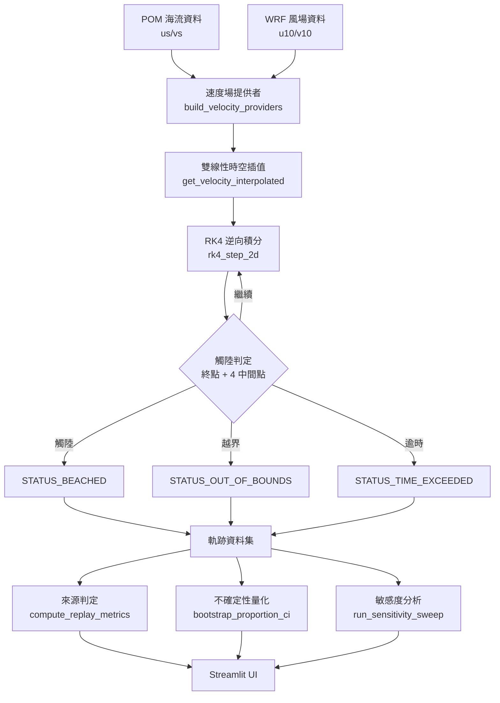

# 海洋塑膠垃圾溯源分析系統 (Ocean Plastic Source Backtracking)

以 **拉格朗日逆向數值積分 (Lagrangian Reverse Integration)** 為核心的海洋塑膠垃圾溯源系統。
結合 POM 三維海流模式與 WRF 大氣風場，透過 **RK4 四階龍格-庫塔法** 將海漂垃圾的觀測位置
沿時間軸反向推演，判定其可能的來源（本地源 vs 境外源），並提供不確定性量化與參數敏感度分析。

---

## 目錄

- [核心功能](#核心功能)
- [科學方法](#科學方法)
- [系統架構](#系統架構)
- [快速開始](#快速開始)
- [資料準備](#資料準備)
- [使用說明](#使用說明)
- [驗證腳本](#驗證腳本)
- [專案結構](#專案結構)
- [常見問題](#常見問題)

---

## 核心功能

| 功能 | 說明 |
|------|------|
| **反向軌跡推演** | 從海岸熱點釋放粒子，沿時間軸反向積分，重建漂流路徑 |
| **來源判定** | 依「本地源關聯半徑」判定粒子最終是否滯留於本地領海（預設 22.2 km = 12 浬） |
| **不確定性量化** | Bootstrap 重抽樣估計「本地源佔比」的 95% 信賴區間與統計顯著性 |
| **參數敏感度分析** | 對單一參數掃描一組值，觀察結論是否穩健（曲線是否跨越 50%） |
| **全台熱點同步反演** | 一次對全部 12 個海岸熱點釋放粒子，比較全台各地的來源傾向 |
| **互動式視覺化** | pydeck 動態軌跡圖層、來源密度熱圖、plotly 統計圖表 |

---

## 科學方法

### 1. 漂流速度合成

粒子在海面的運動速度由海流與風生漂流合成：

$$
\vec{V}_{\text{total}} = \vec{V}_{\text{current}} + w \cdot \vec{V}_{\text{wind}}
$$

其中 $w$ 為**風阻係數 (windage)**，代表物體受風影響的比例（例如寶特瓶約 1.5%）。

### 2. RK4 逆向積分

以四階龍格-庫塔法對位置進行時間反向積分：

$$
\frac{d\vec{x}}{dt} = -\vec{V}_{\text{total}}(\vec{x}, t)
$$

每一步計算 4 個中間點（$k_1, k_2, k_3, k_4$），並檢查**終點與所有中間點**是否觸陸，
以避免大步長跨越狹窄陸地（海岬、沙洲）造成的漏判。

### 3. 來源判定

粒子回溯至起算時刻後，計算其與釋放熱點的距離：

- **本地源 (Local Source)**：最終位置落在關聯半徑內
- **境外源 (External Source)**：最終位置超出關聯半徑

### 4. 不確定性量化

以 Bootstrap 重抽樣（$n_{\text{boot}} = 2000$）估計本地源佔比的 95% 信賴區間：

- **顯著 (Significant)**：CI 完全落在 50% 同一側
- **不顯著 (Not Significant)**：CI 跨越 50%

---

## 系統架構



---

## 快速開始

### 1. 安裝依賴

```bash
pip install -r requirements.txt
```

### 2. 準備資料

本專案需要 POM 海流與 WRF 風場資料，支援兩種佈局（見 [資料準備](#資料準備)）。

### 3. 啟動應用

```bash
streamlit run ck.py
```

瀏覽器會自動開啟 `http://localhost:8501`。

---

## 資料準備

系統支援兩種資料佈局，**優先使用精簡資料**：

### (A) 精簡資料佈局（推薦）

由 `prepare_local_data.py` 從原始資料庫萃取，只保留實際使用的欄位，約 **1.15 GB**：

```
slim_data/
├── pom_currents_slim.nc   # POM 海流：us, vs, lat, lon, time
└── wrf_wind_slim.nc       # WRF 風場：u10, v10, latitude, longitude, time
```

產生方式：

```bash
python prepare_local_data.py
```

### (B) 原始資料佈局

完整 NODASS 資料庫，約 **424 GB**，通常位於外接硬碟：

```
<DATA_ROOT>/
├── POM/2d/2025/12/pom_t3.YYYYMMDD00.2d.nc
└── WRF/...
```

### 資料來源解析順序

1. 環境變數 `PLASTIC_DATA_ROOT`（若指向含 `POM/` 的目錄）
2. 專案內 `slim_data/`（若兩個精簡檔皆存在）
3. 專案根目錄（若含 `POM/`）
4. 硬編碼外接硬碟路徑 `F:\20260907_塑源`

### 測試用 Mock 資料

若無真實資料，可產生小型 mock 資料集進行功能測試：

```bash
python create_mock_pom.py
```

---

## 使用說明

### 側邊欄參數

| 區塊 | 參數 | 說明 |
|------|------|------|
| **1. 追溯起始熱點** | 選擇目標海岸熱點 | 12 個預設熱點、🌏 全部熱點、或自訂座標 |
| **2. 時間維度** | 回溯模擬天數 | 1~30 天 |
| | 數值積分步長 | 30 min ~ 3 hr |
| **3. 本地源關聯半徑** | 判定半徑 | 10~50 km（預設 22.2 km） |
| **4. 漂流動力學** | 模擬粒子總數 | 50~1000 |
| | 海廢材質特性 | 寶特瓶 / 漁網 / 保麗龍等預設 |
| | 海面風阻係數 | 0~5% |
| **5. 起始時間** | 回溯起算日期 | 須落在資料涵蓋範圍內 |

### 三個分析分頁

1. **溯源推演 (Trajectory & Heatmap)** — 動態軌跡圖層、來源密度熱圖、核心 KPI
2. **群體統計分析 (Ensemble Analytics)** — 漂流里程分佈、粒子最終歸宿分佈
3. **敏感度分析 (Sensitivity Analysis)** — 參數掃描曲線、穩健性判定

---

## 驗證腳本

本專案以「可證偽」的測試逐層驗證每個環節：

| 腳本 | 驗證內容 | 結果 |
|------|----------|------|
| `verify_all_parameters.py` | 六層全參數驗證（資料層/時間索引/插值/RK4/軌跡） | 37/37 PASS |
| `verify_simulation.py` | 獨立驗收：物理量探針、單步算子可逆性 | 12/12 PASS |
| `verify_land_crossing_fix.py` | 跨格穿陸修復（黃金標準 0.2 km 採樣比對） | PASS |
| `verify_no_land_crossing.py` | 實際模擬輸出零穿陸驗證 | PASS |
| `verify_time_coverage_fix.py` | 時間凍結偽漂流修復 | 10/10 PASS |
| `verify_strict_time_window.py` | 時間視窗嚴格檢查（越界直接報錯） | 10/10 PASS |
| `verify_uncertainty_quantification.py` | Bootstrap CI 正確性（覆蓋率/收斂/顯著性） | 18/18 PASS |
| `verify_sensitivity_analysis.py` | 敏感度掃描正確性（結構/單調/穩健性） | 20/20 PASS |
| `verify_local_data.py` | 精簡資料與原始資料逐點數值一致 | PASS |

執行方式：

```bash
python verify_all_parameters.py
```

---

## 專案結構

```
plastic/
├── ck.py                              # 主應用程式（Streamlit）
├── prepare_local_data.py              # 從原始資料萃取精簡資料集
├── create_mock_pom.py                 # 產生測試用 mock 資料
├── requirements.txt                   # Python 依賴
├── README.md                          # 本文件
├── .gitignore                         # Git 忽略規則
│
├── verify_all_parameters.py           # 全參數驗證
├── verify_simulation.py               # 獨立驗收驗證
├── verify_land_crossing_fix.py        # 跨格穿陸修復驗證
├── verify_no_land_crossing.py         # 零穿陸驗證
├── verify_time_coverage_fix.py        # 時間覆蓋修復驗證
├── verify_strict_time_window.py       # 時間視窗嚴格檢查驗證
├── verify_uncertainty_quantification.py  # 不確定性量化驗證
├── verify_sensitivity_analysis.py     # 敏感度分析驗證
├── verify_local_data.py               # 精簡資料一致性驗證
│
├── slim_data/                         # 精簡資料集（.gitignore 排除）
│   ├── pom_currents_slim.nc
│   └── wrf_wind_slim.nc
└── mock_pom_taiwan.nc                 # 測試用 mock 資料（.gitignore 排除）
```

---

## 常見問題

### Q: 啟動時顯示「找不到 POM 海流檔案」？

請確認資料佈局正確。最簡單的方式是執行 `prepare_local_data.py` 產生 `slim_data/`，
或設定環境變數：

```bash
# Windows PowerShell
$env:PLASTIC_DATA_ROOT = "F:\20260907_塑源"
```

### Q: 為什麼粒子會「一步跳很遠」？

請檢查**風阻係數單位**。系統內部使用**小數**（`0.015` = 1.5%），
若誤傳百分比（`1.5`）會放大風速 100 倍，導致粒子一步跳 35 km 直接越界。

### Q: 敏感度分析顯示「結論不穩健」是什麼意思？

代表「本地源佔比」在掃描範圍內**跨越 50%**，即來源判定會隨該參數改變而翻盤。
這表示結論對該參數敏感，需要更精確的參數估計才能下定論。

### Q: 為什麼回溯天數越長，結果反而不同？

系統採用**嚴格時間視窗檢查**：若回溯起點超出資料涵蓋範圍，會直接報錯而非自動平移。
請確認回溯天數與起算日期落在資料範圍內。

### Q: Windows 終端機中文亂碼？

設定 UTF-8 輸出：

```powershell
$env:PYTHONIOENCODING="utf-8"
[Console]::OutputEncoding=[System.Text.Encoding]::UTF8
```

---

## 授權

本專案為學術研究用途。資料來源為 NODASS（國家海洋資料庫及共享平台）。
